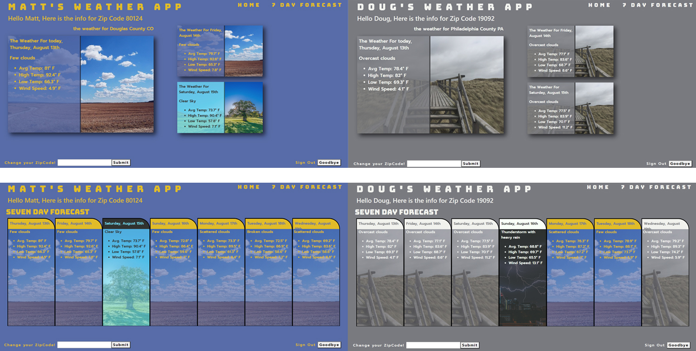

# Matt's Weather App
[See it in Action](https://matt-rogers-weather-app.herokuapp.com/hello)

An Express app that gives users weather based on their zipcode. 


## Motivation
I wanted to create an app using express, axios, and cookies.

## Build Status
Complete and forecasting weather across the US.


#### bugs
-[ ] Page does not update css when zipcode is updated

* possible fixes
  * I think the server needs to be refreshed.
    * there maybe an npm for this
#### Todo
-[ ] Add css animation to login page

* How todo it
  * GSAP 

## Tech/framework used
* [Pug.js](https://pugjs.org/api/getting-started.html)
* Express
* Nodejs
* dotenv
* axios
* jQuery
* [Bootstrap](https://getbootstrap.com/)
* [Cookie-parser](https://www.npmjs.com/package/cookie-parser)
* [Openweather API](https://openweathermap.org/appid)

## Features
The styling is determined by today's weather


## Code style
jQuery, Express, and Pug


## Installation
* :trident: Fork it
* :sheep: Clone it
* Get your api key for [Openweather API](https://openweathermap.org/appid)
* Install Dependencies
```
$ npm install pug
$ npm install express --save
$ npm install dotenv
$ npm install axios
$ npm install cookie-parser
```

## API Reference
[Openweather API](https://openweathermap.org/appid) 16 Day forecast [Docs](https://openweathermap.org/forecast16)


## How to use?
 1. Enter a name under 15 letters
 2. Enter A valid Zipcode
 3. Click Seven Day forecast to get the weeks weather
 4. Click goodbye to log out and clear cookies.

## Credits / Contact information
* @MattRoger 
  * :octocat: [Github](https://mattroger.github.io)
  * :e-mail: mattroger.webdev@gmail.com
  * :man_office_worker: www.linkedin.com/in/matt-roger/


